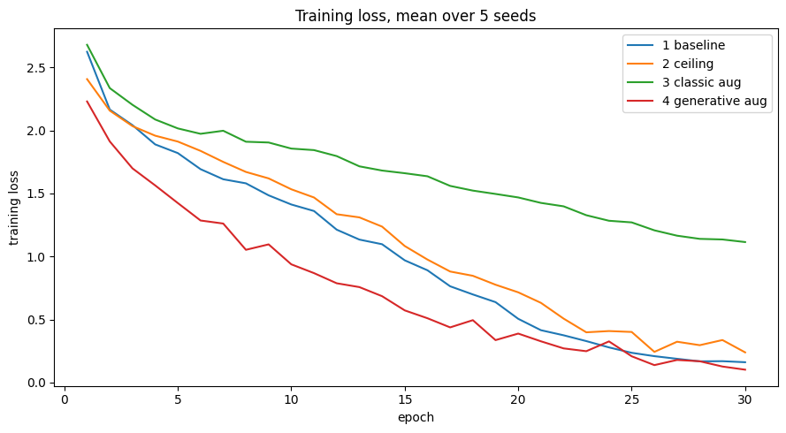
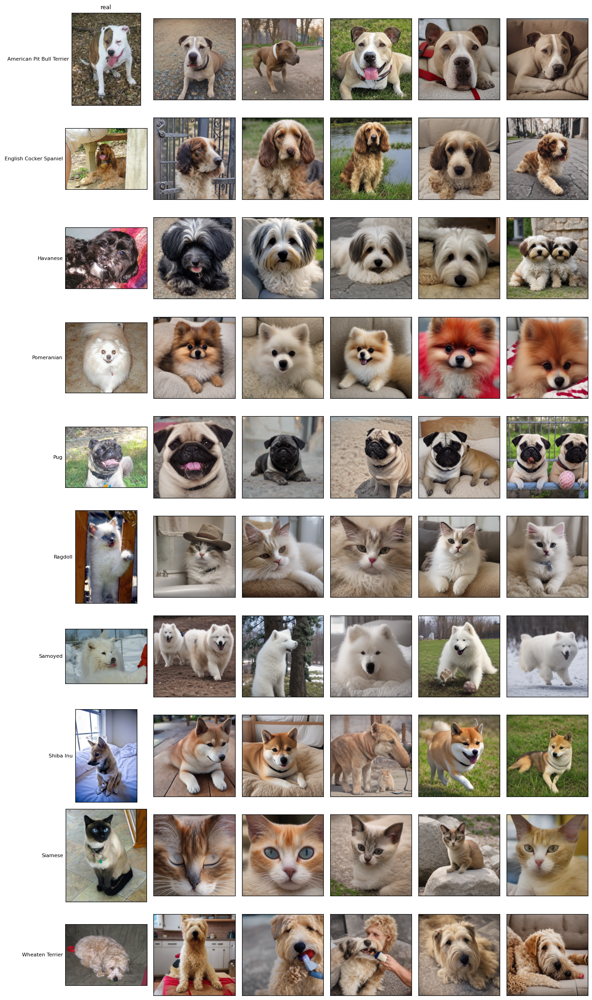
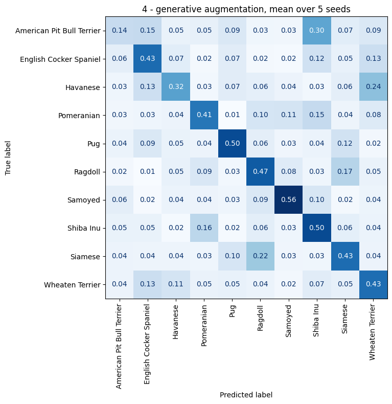

# Is a Synthetic Image Worth a Real One?

Generative data augmentation on OxfordIIITPet, measured against the real images
it is meant to replace.

Most generative augmentation demos stop at "I generated images and accuracy went
up". That leaves the important question open: **up compared to what?** This study
adds a ceiling — the same number of real images the synthetic ones stand in for —
so the gain can be read as a fraction of what real data is worth, not as a number
floating on its own.

## Result
Training a ResNet18 from scratch on 400 real images, then adding 595 images
generated by SD-Turbo:


| Setup | Images | Accuracy |
|---|---|---|
| baseline | 400 real | 0.304 ±0.010 |
| classic augmentation | 400 real, transformed | 0.290 ±0.016 |
| **generative augmentation** | 400 real + 595 synthetic | **0.419 ±0.035** |
| ceiling | 995 real | 0.409 ±0.018 |

Expressed in combined standard deviations, which is the only honest way to read
differences this size:

| Comparison | Δ accuracy | in sd |
|---|---|---|
| generative vs baseline | +0.114 | 3.2 |
| generative vs ceiling | +0.010 | 0.2 |
| classic vs baseline | −0.014 | −0.7 |

**Generative augmentation recovers the gain that 595 additional real images would
have produced.** The effect against the baseline is measured, not asserted. The
difference against the ceiling is 0.2 sd, which supports equivalence between a
synthetic image and a real one — and does not support any claim of an advantage.

This holds when the classifier is trained from scratch. With an ImageNet backbone
the effect disappears entirely — see [Where the effect disappears](#where-the-effect-disappears).



Classic augmentation is the only setup still above 1.0 after 30 epochs: it is cut
off before convergence rather than failing outright. Generative augmentation ends
lowest of all, below the ceiling on the same number of images — synthetic images
are more regular and easier to fit.

## Protocol

Every setup shares the same architecture, hyperparameters, test set and seeds.
The only variable is the training set.

- **5 seeds per setup**, tables report mean and standard deviation. With a single
  run the ranking changed depending on the seed, so single runs are not
  comparable at this effect size
- **the synthetic set is capped at 595 images**, matching the ceiling class by
  class. The pipeline could produce many more, but that would measure volume
  instead of the value of a synthetic image against a real one
- **no pretrained weights** in the main study: with ImageNet weights the baseline
  is already at 94.5% and the effect disappears (see below)
- **confusion matrices are averaged over the seeds**, not taken from a single run

## Two checks beyond the accuracy table



One real image per breed in the first column, five generated ones next to it.

**Are the generated images actually the right breed?** Judging this by eye is not
reliable, so CLIP scores both sets zero-shot, with the real training images as a
control group. Agreement is 98% on both. The weakest class is Siamese at −0.09,
and the classifier confuses the same two cat breeds. One caveat stated in the
notebook: SD-Turbo conditions on a CLIP text encoder, so this check is partly
circular.

**Does it survive degraded input?** The use case is surveillance footage, where
frames are blurred by optics, motion and cheap sensors. Every checkpoint is
re-scored on a blurred test set, with no retraining:

| Setup | clean | light blur | strong blur | Δ |
|---|---|---|---|---|
| baseline | 0.304 | 0.291 | 0.276 | −0.028 |
| ceiling | 0.409 | 0.395 | 0.355 | −0.054 |
| generative | 0.419 | 0.414 | 0.383 | −0.036 |

The synthetic setup does not degrade faster, contrary to what one might expect
from images that are cleaner and more regular than real ones — the gap against
the ceiling widens from +1.0 to +2.8 points. A plausible reading is that SD-Turbo
at one step produces little fine detail, so the classifier never learns to rely
on high frequency cues. The trend stays within one standard deviation, so it is
consistent rather than measured.

## Where the effect disappears

With an ImageNet backbone the picture changes: baseline 0.945, generative 0.944,
classic 0.953. The 595 synthetic images neither help nor hurt.

This is a statement about this dataset, not about the method. ImageNet covers
cats and dogs well, so extra images of them carry little new information. A
target domain it does not cover puts the model back in the from-scratch regime,
which is where the 11 points were.

## Per class



The largest gains are Shiba Inu (0.21 to 0.50) and Pug (0.20 to 0.50). Siamese
improves but keeps sending 0.22 of its mass onto Ragdoll in every setup — the
same weakness the CLIP check flagged. The two cat breeds are where both the
generator and the classifier struggle.

## Pipeline

BLIP captions the 400 real images, flan-t5-base rewrites each caption into two
variants, the breed name is prepended from the label, and SD-Turbo generates one
image per prompt in a single denoising step.

## Running it

The notebook runs end to end on a Colab T4 in roughly two hours, most of it
training. Nothing needs to be downloaded by hand.

```
pip install -r requirements.txt
```

## Limits

- five seeds bound the noise but do not make a 0.2 sd difference measurable;
  the equivalence claim is supported, not proven
- the CLIP quality check is partly circular, as noted above
- the synthetic set was capped on purpose, so the effect of generating far more
  images is untested: the advantage may keep growing, or the model may start
  learning SD-Turbo's artefacts instead of the breeds
- the prompt rewriting step samples without a fixed generator, so the generated
  images are not reproducible across a kernel restart
